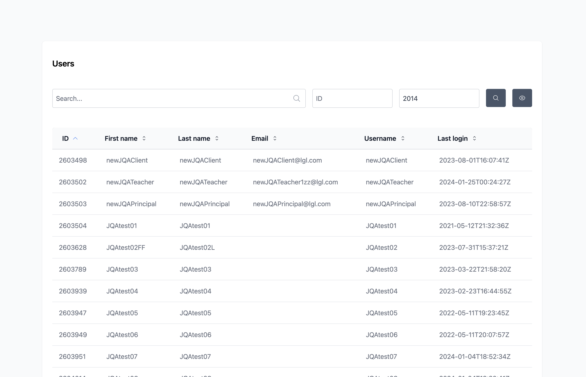

---
# https://vitepress.dev/reference/default-theme-home-page
layout: home

hero:
  name: "Go Tables"
  text: "Go + Vue + Inertia"
  tagline: Companion backed package for inertia-vue-tables component
  actions:
    - theme: brand
      text: Get Started
      link: /introduction
    - theme: alt
      text: Vue Table Component
      link: https://github.com/humweb/inertia-vue-table

features:
  - title: Filters
    details: Filter by text or select list of options
  - title: Searching
    details: Search specific columns or across many at the same time
  - title: Relationships
    details: Eager load relationships globally or at runtime
---

